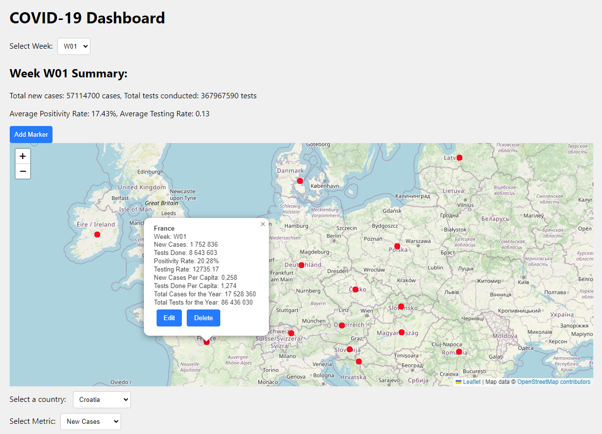

# COVID-19 Data Analysis and Visualization Project

## Overview

Welcome to the COVID-19 Data Analysis and Visualization Project. This project was made for the integration of information systems class in my faculty and contains in-depth exploration and visual representation of COVID-19 data spanning on the year 2022, with a particular emphasis on European countries. The project leverages data processing techniques, system integration principles, and technologies to deliver comprehensive insights into the evolution of the pandemic.

The API was made using C# .NET 6 and the front end using React (and some libraries). Testing was done with Postman and data was stored using MySQL and i documented my code with Doxygen/Swagger.

## Key Features

### 1. Data Collection and Integration

The project initially employed Extract, Transform, Load (ETL) tools to collect and integrate COVID-19 data from a fataset provided from the european union, offering a detailed analysis of the pandemic's impact on the region.

### 2. Covid Services

Services to collect, process, and present pandemic-related data was the main focus of the project.

### 3. Geolocation Services

Adding to the Covid Services, integration with the OpenCage Geocoding API improves the dataset, providing geographical context to the COVID-19 data. This enables spatial visualization, enhancing the understanding of data in specific regions.

To prevent too many API calls a Cache was also implemented.

### 3. Dashboard 

A Dashboard serves as the central hub for exploring the collected data. This interface offers a visual representation of key metrics and trends, providing users with an efficient and accessible means of interacting with the information.

## System Integration and Practical Applications

Like i mentioned, this project serves as a practical showcase of system integration concepts. By connecting web services, external APIs, and cloud infrastructure, it exemplifies how disparate components can be harmoniously orchestrated to create a cohesive and powerful system.

## Getting Started

To explore the project and access the dashboard just run both the API and the Front-end.

## Dashboard Preview

## Conclusion

Throughout this project, I gained a deeper understanding of the tools and methods employed in handling complex datasets and creating meaningful visual representations work, and was able to gain interest in Cloud practices.